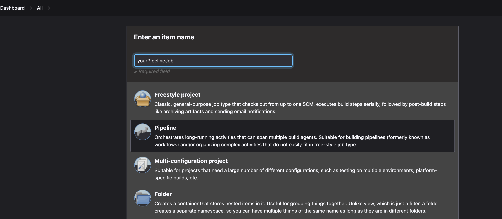
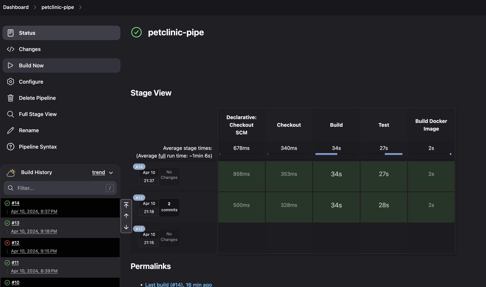

- Install Jenkins and follow instructions
- Install suggested plugins when prompted
- Create new Jenkins job
- Choose pipeline job

- Go down to Pipeline settings, choose "Pipeline script from SCM," and fill in appropriate settings

- Save and go to job
- Choose "Build Now"
