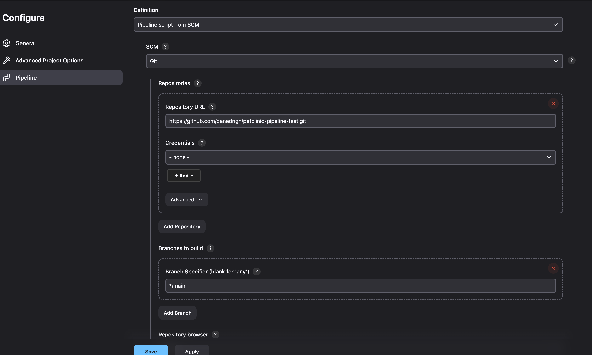

- Install Jenkins and follow instructions
- Install suggested plugins when prompted
- Create new Jenkins job
- Choose pipeline job

- Go down to Pipeline settings, choose "Pipeline script from SCM," and fill in appropriate settings for repository

- Save and go to job
- Choose "Build Now"

- Jenkins will build the jar, runtests, and build a docker image on its local machine
- Run the docker image with "docker run -p 8080:8080 petclinic:<latestBuildNumber>"